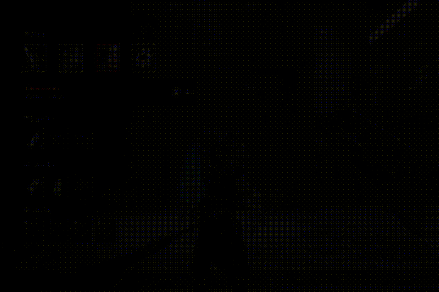

# Lies of P Save Editor ⚙️

A custom save editor for *Lies of P* that allows players to view and modify their saves on **PC, Xbox GamePass and PS4**.  
⚠️ Always back up your save files before making any edits.

---

## 📖 How to Use

### 1. Exit the Game Properly
Before editing, you must **quit Lies of P through the settings menu** — not just by closing the game.  
This ensures your save isn’t left in a corrupted state.

<video src="./assets/settingsquit.mp4" width="600" controls></video>  
[▶ Watch Settings Quit Demo](./assets/settingsquit.mp4)
=======

MAKE SURE TO QUIT THE GAME THIS WAY TO PREVENT THE PROFILE FROM LOADING YOUR PREVIOUS SAVE DUE TO "CORRUPTION"
---

### 2. Copy All Saves
On **PS4**, you need to copy **every Lies of P save file** to your USB or storage device, **even if you only want to edit one save**.  
This ensures the save data updates correctly when transferred back.

<video src="./assets/ps4savecopy.mp4" width="600" controls></video>  
[▶ Watch PS4 Save Copy Demo](./assets/ps4savecopy.mp4)
=======

YOU CAN ONLY COPY PS4 DATA NOT PS5 (THE PS4 VERSION OF THE GAME [YES THERE IS A PS4 VERSION ON PS5)
---

## 🚀 Features
- View & edit character data  
- Modify currencies and stats  
- Change inventory and mission flags  
- Export saves between PC and PS4  

---

## ⚠️ Important Notes
- Not affiliated with Neowiz or Round8 Studio.  
- Use at your own risk.  
- Always keep backups of your original saves.  
